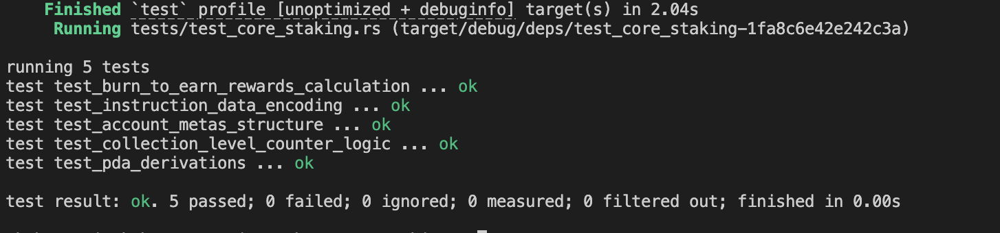

# NFT Staking Core

A Solana Anchor program implementing an NFT staking system using Metaplex Core.

## Features

- Initialize staking configuration
- Create a Metaplex Core collection
- Mint NFTs into the collection
- Stake NFTs
- Unstake NFTs
- Claim rewards without unstaking
- Burn a staked NFT for burn-to-earn rewards
- Track collection-level `total_staked`

## Project Structure

```text
anchor-core-staking/
├── Anchor.toml
├── Cargo.toml
├── programs/
│   └── anchor-core-staking/
│       ├── Cargo.toml
│       └── src/
│           ├── constants.rs
│           ├── error.rs
│           ├── instructions.rs
│           ├── lib.rs
│           ├── state.rs
│           └── instructions/
│               ├── initialize.rs
│               ├── create_collection.rs
│               ├── mint_asset.rs
│               ├── stake.rs
│               ├── unstake.rs
│               ├── claim_rewards.rs
│               └── burn_staked_nft.rs
└── tests/
    └── test_core_staking.rs
```

# Program Instructions

| # | Instruction | Description |
|---|---|---|
| **1** | **Initialize** | Initializes the staking configuration and creates the reward token mint. |
| **2** | **Create Collection** | Creates a Metaplex Core collection. |
| **3** | **Mint Asset** | Mints a Metaplex Core NFT into the staking collection. |
| **4** | **Stake** | Stakes a Metaplex Core NFT. |
| **5** | **Claim Rewards** | Allows the user to claim staking rewards without unstaking the NFT. |
| **6** | **Unstake** | Unstakes an NFT after the configured freeze period. |
| **7** | **Burn Staked NFT** | Implements the burn-to-earn flow. |

---

### 1. Initialize

| Parameters | Configuration PDA | Rewards Mint PDA |
|---|---|---|
| `rewards_bps`<br>`freeze_period` | `["config", collection]` | `["rewards_mint", config]` |

> Initializes the staking configuration and creates the reward token mint.

---

### 2. Create Collection

| Parameters | Update Authority |
|---|---|
| `name`<br>`uri` | `["update_authority", collection]` |

> Creates a Metaplex Core collection using a program-derived update authority.

---

### 3. Mint Asset

| Parameters | Result |
|---|---|
| `name`<br>`uri` | The NFT is owned by the user and belongs to the collection. |

> Mints a Metaplex Core NFT into the staking collection.

---

### 4. Stake

> Stakes a Metaplex Core NFT.

| State / Action | Result |
|---|---|
| `staked` | `true` |
| `staked_at` | Current timestamp |
| `FreezeDelegate` | Freezes the NFT |
| `StakeState` | Account is created |
| `total_staked` | Incremented |

**Stake State**

| Field | Field | Field |
|---|---|---|
| `owner` | `last_claimed_at` | `bump` |

**Stake State PDA**

`["stake_state", asset]`

---

### 5. Claim Rewards

> Allows the user to claim staking rewards without unstaking the NFT. The NFT remains staked and frozen.

| Reward Calculation | Destination | After Claim |
|---|---|---|
| `days × rewards_bps × 10^decimals / 10,000` | User's reward-token ATA | `last_claimed_at` is updated |

> The calculated reward tokens are minted to the user's reward-token ATA. After claiming, `last_claimed_at` is updated so the same staking period cannot be claimed again.

---

### 6. Unstake

> Unstakes an NFT after the configured freeze period.

| Action | Result |
|---|---|
| `staked` | `false` |
| `staked_at` | `0` |
| NFT | Unfrozen |
| `StakeState` | Account is closed |
| `total_staked` | Decremented |
| Staking rewards | Minted to the user |

> The freeze period is checked using the elapsed number of staking days.

---

### 7. Burn Staked NFT

> Implements the burn-to-earn flow. The NFT must already be staked.

| Action | Result |
|---|---|
| NFT | Unfrozen |
| NFT | Burned |
| `total_staked` | Decremented |
| Burn rewards | Calculated |
| Reward tokens | Minted to the user's reward-token ATA |

**Burn Reward**

`burn_reward = base_reward × 5`

> The burn reward uses a 5x multiplier.

## Dependencies

```toml
[dependencies]
anchor-lang = { version = "0.31.1", features = ["init-if-needed"] }
anchor-spl = "0.31.1"
mpl-core = { version = "0.11.2", default-features = false, features = ["anchor"] }
```

## Building

Build the program with:

```bash
anchor build
```

## Testing

The project uses a Rust integration test:

```text
tests/test_core_staking.rs
```

Run the test suite with:

```bash
cargo test --test test_core_staking or anchor test
```


## Burn-to-Earn Reward Calculation

| Test Parameter | Value |
|---|---:|
| `rewards_bps` | `500` |
| `decimals` | `6` |
| Staking duration | `10 days` |
| Burn bonus multiplier | `5` |

| Calculation | Result |
|---|---:|
| Base reward | `500,000` |
| Burn-to-earn payout | `2,500,000` |

---

## Collection Counter Test

The collection counter is tested through the following sequence for three staked NFTs:

| Operation | Counter |
|---|---:|
| Initial | `0` |
| Stake #1 | `0 → 1` |
| Stake #2 | `1 → 2` |
| Stake #3 | `2 → 3` |
| Unstake #1 | `3 → 2` |
| Unstake #2 | `2 → 1` |
| Unstake #3 | `1 → 0` |

### Underflow Protection

The test also verifies that subtracting below zero remains at:

| Condition | Result |
|---|---:|
| `0 - 1` | `0` |


## Result


