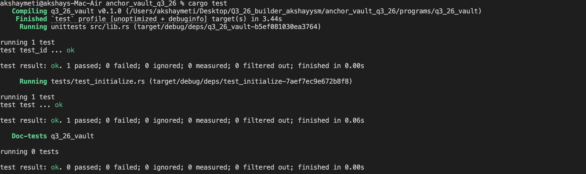

A **Solana** program built with **Anchor**. Each user gets their own vault: they can put SOL in, take SOL out, and close the vault when they are done.

## What is this, in one sentence?

Think of a **personal piggy bank on Solana**. You create it, deposit SOL, withdraw SOL, then close it and get the leftover SOL (and rent) back.

SOL is Solana’s native coin. Amounts in the program are in **lamports** (the smallest unit):

`1 SOL = 1,000,000,000 lamports`

---

| Word | Meaning |

| **Program** | Code that lives on the Solana blockchain (like a smart contract). This repo *is* that program. |
| **Account** | A place that stores data or SOL. Wallets are accounts. Vaults are accounts too. |
| **Instruction** | One action you ask the program to do (`initialize`, `deposit`, `withdraw`, `close`). |
| **Signer** | The wallet that signed the transaction. Here, that is the **user**. Only they can touch *their* vault. |
| **PDA** (Program Derived Address) | An address the program can “own” and sign for. We use PDAs so the vault is unique per user and the program can move SOL out of it. |
| **Bump** | A small number used when finding a PDA. We store it so later instructions use the same address. |
| **Rent** | SOL that must stay in an account so Solana keeps it. If an account is empty, it can be deleted. |
| **CPI** | One program calling another. Transfers of SOL go through the **System Program**. |
| **Lamports** | Smallest unit of SOL (see above). 

## Instructions

| Instruction | What it does |
| --- | --- |
| `initialize` | Creates `vault_state` (stores PDA bumps) and funds `vault` with rent-exempt SOL |
| `deposit(amount)` | Transfers SOL from the user to `vault`. |
| `withdraw(amount)` | Transfers SOL from `vault` back to the user (program signs as the vault PDA).|
| `close` | Sends remaining vault SOL to the user and closes `vault_state` |

Each user has two PDAs, seeded with their pubkey:

- `vault_state` — seeds `["state", user]`
- `vault` — seeds `["vault", user]` (holds the SOL)

## Build and test

`anchor build`

 `anchor test`. Tests run with LiteSVM. The test covers initialize → deposit 0.5 SOL → withdraw 0.1 SOL → close.
