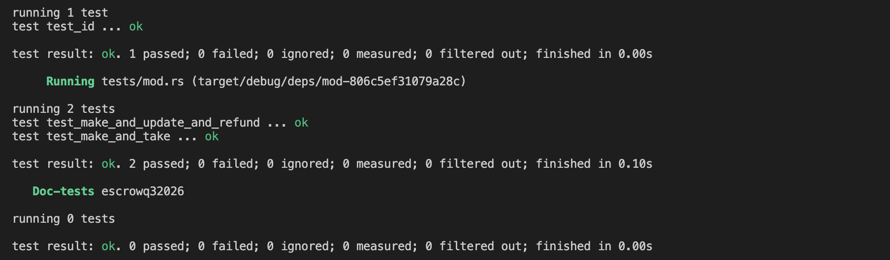

# Escrow 


A Solana escrow program built with Anchor.

The program allows two parties to exchange SPL tokens without requiring a trusted third party.

## Instructions

The program implements four instructions:

- `make` — Maker creates an escrow, deposits Token A into a program-controlled vault, and specifies the amount of Token B they want.
- `take` — Taker sends the requested Token B to the maker and receives Token A from the vault.
- `refund` — Maker reclaims Token A and closes the escrow and vault.
- `update` — Maker updates the amount of Token B they want to receive.

## Tests

Tests are written in Rust using LiteSVM.

The test suite covers:

- `make`
- `update`
- `refund`
- `take`

Test flows include:

- `make → update → refund`
- `make → take`

Run the tests with:

```bash
anchor test
