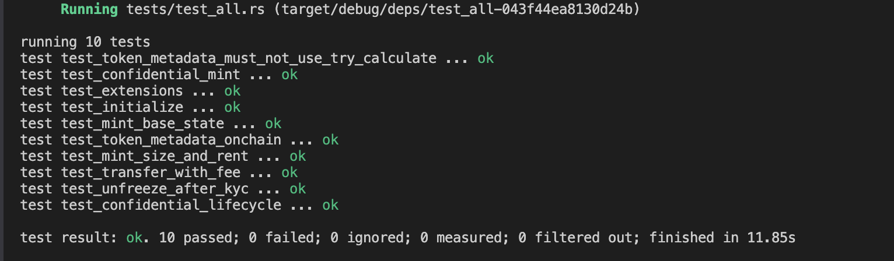

# Token-22 (RUSD)



Anchor program that creates a **Token-2022** remittance token (**Remittance USD / RUSD**) with a 1% transfer fee, frozen-by-default accounts (thaw after KYC), on-chain metadata, and an optional confidential mint.

It does not replace Token-2022. It CPIs into it.

**Program ID:** `3kjBCVZPCqW6e6JLFCBkTWPocDH1TD6GgB6XEiLw1qVc`

| | |
|---|---|
| Name / symbol | Remittance USD / RUSD |
| Decimals | 6 |
| Transfer fee | 100 bps (1%) |
| Default account state | Frozen |

Fee example: send `10_000` → recipient `9_900`, withheld `100`.

---

## Two mints

Pick one at creation. Extensions cannot be added later.

**`initialize`** — public mint:

- `TransferFeeConfig`
- `MintCloseAuthority`
- `DefaultAccountState` (Frozen)
- `MetadataPointer` (mint points at itself) + `TokenMetadata`

**`initialize_confidential_mint`** — same as above, plus:

- `PermanentDelegate` (seizure authority)
- `ConfidentialTransferMint` (manual approve: `auto_approve_new_accounts = false`)
- `ConfidentialTransferFeeConfig`

Pass the withdraw-withheld ElGamal pubkey (`[u8; 32]`).

The payer is mint, freeze, fee, close, metadata, and (on the confidential mint) delegate / confidential authority. Fine for tests; split keys in production.

---

## Instructions

| Instruction | What it does |
|---|---|
| `initialize` | Create the public mint |
| `transfer_with_fee(amount, decimals)` | Public transfer; fee from `calculate_epoch_fee` + `transfer_checked_with_fee` |
| `unfreeze_kyc_account` | Freeze authority thaws **one** account. Mint default stays Frozen. KYC is off-chain. |
| `initialize_confidential_mint` | Create the confidential mint |
| `deposit_confidential(amount, decimals)` | Public balance → pending confidential |
| `apply_pending_balance(...)` | Pending → available confidential |

Configure account, confidential transfer, and withdraw are **Token-2022**, not `t22` ixs. The integration test runs them end-to-end.

---

## Public flow

1. `initialize`
2. Create a token account → starts **Frozen**
3. After KYC, `unfreeze_kyc_account`
4. Mint tokens (Token-2022 mint-to)
5. `transfer_with_fee`

---

## Confidential flow

1. `initialize_confidential_mint`
2. Create account, owner **ConfigureAccount**, authority **ApproveAccount** (manual policy)
3. Mint public tokens → `deposit_confidential` → `apply_pending_balance`
4. Confidential transfer (1% encrypted fee)
5. Recipient `apply_pending_balance`, then withdraw to public if needed

Test numbers: Alice deposits `10_000`; transfers `2_500`; Bob gets `2_475` pending; applies; withdraws `1_000`; `1_475` confidential left.

---

## Build and test

```bash
anchor build
cargo test      # or: anchor test
```

Tests use LiteSVM and need `target/deploy/t22.so`. No local validator.

Layout: `programs/t22/src/` (program), `programs/t22/tests/` (LiteSVM tests).